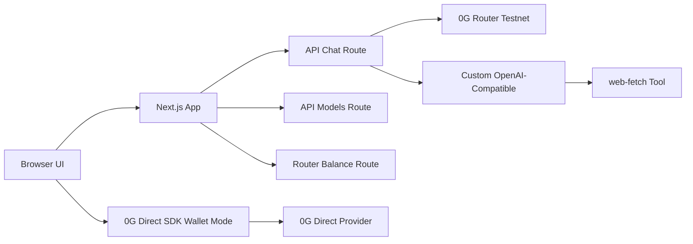

# 0G AI Console

0G AI Console is a Next.js App Router application for experimenting with 0G-powered inference, custom OpenAI-compatible routers, wallet-connected 0G Direct SDK providers, and AI SDK streaming chat in one interface.

Live app: https://0gai.uratmangun.ovh

## What This App Does

The app provides a docs-focused AI chat surface with three inference modes:

- **0G Router Testnet**: server-side shared 0G Router access using `ZERO_G_ROUTER_API_KEY`. Router streaming is adapted for the AI SDK UI stream and 0G-specific trace frames are filtered out.
- **0G Direct SDK**: wallet-signed provider access using `@0gfoundation/0g-compute-ts-sdk`, Privy, wagmi, and viem. Users connect a wallet on 0G Galileo testnet, load Direct chatbot services, and send requests through selected providers.
- **Custom OpenAI-compatible**: user-configurable base URL, API key, and model for OpenAI-compatible routers such as CLIProxyAPI. This mode supports AI SDK tool calling.

The chat UI uses AI Elements components for conversations, messages, prompt input, and collapsible tool call cards.

## Key Features

- Next.js 16 App Router with standalone production output.
- React 19 client UI with Tailwind 4 and shadcn/ui-style primitives.
- AI SDK 6 streaming chat with typed UI messages.
- Custom OpenAI-compatible provider support via `@ai-sdk/openai-compatible`.
- Tool calling for custom providers through the `web-fetch` tool.
- Direct `fetch()`-based web fetch tool that prefers Markdown, detects HTML/text, saves fetched content to `/tmp`, and returns previews to the model.
- 0G Router Testnet mode with tools disabled for provider compatibility.
- 0G Router stream adapter that drops vendor-only `x_0g_trace` SSE frames.
- 0G Direct SDK service discovery and wallet-signed request headers.
- Privy wallet login and wallet funding/export controls.
- Router balance display for the shared server-side 0G Router account.
- Fixed-height scrollable chat panel and collapsed-by-default tool call cards.
- Podman Quadlet deployment behind Cloudflare Tunnel.

## Architecture



## Provider Modes

### 0G Router Testnet

`0g-router-testnet` uses server-side configuration from:

- `ZERO_G_ROUTER_API_KEY`
- `ZERO_G_ROUTER_BASE_URL` optional, defaults to `https://router-api-testnet.integratenetwork.work/v1`

This mode intentionally does not send tools. Some 0G Router testnet models reject function-calling payloads. The route also handles an extra 0G-specific streamed trace object:

```json
{"x_0g_trace":{"request_id":"...","provider":"...","billing":{}}}
```

That trace frame is not part of the OpenAI streaming schema, so the app proxies Router SSE into AI SDK UI-message SSE and drops the trace frame.

### Custom OpenAI-Compatible

`custom-openai` lets users provide:

- Base URL, for example ``
- API key
- Fallback model, for example `gpt-5.5` or `kilo-auto/free`

Custom providers use `streamText()` and get tool calling enabled. The current server tool is `web-fetch`.

Custom provider config can be saved in `localStorage`. Avoid saving high-value production keys in a shared browser environment.

### 0G Direct SDK

`0g-direct` uses a connected wallet and the 0G Compute SDK:

- Lists available chatbot services.
- Selects provider/model entries.
- Requests signed inference headers from the broker.
- Sends chat completions directly to provider endpoints.
- Optionally verifies responses when provider metadata supports it.

This mode targets 0G Galileo testnet in the current UI.

## Tool Calling

The `web-fetch` tool lives in `lib/web-fetch-tool.ts`. It:

- Fetches URLs directly with `fetch()`.
- Sends an `Accept` header preferring Markdown, then HTML, then text.
- Detects Markdown by content type or `.md` / `.mdx` URL extension.
- Detects HTML by content type or `.html` / `.htm` extension.
- Returns `content`, `contentFormat`, `contentType`, `contentLength`, `textPreview`, `finalUrl`, and `outputPath`.
- Includes `markdown`/`markdownLength` or `html`/`htmlLength` when applicable.

Tool call UI is rendered with `components/ai-elements/tool.tsx` and is collapsed by default.

## Environment Variables

Create `.env.local` for local development:

```bash
ZERO_G_ROUTER_API_KEY=your_0g_router_key
ZERO_G_ROUTER_BASE_URL=https://router-api-testnet.integratenetwork.work/v1
NEXT_PUBLIC_PRIVY_APP_ID=your_privy_app_id
```

Optional custom providers are entered in the UI and stored locally in browser storage if saved.

## Local Development

Install dependencies and run the dev server:

```bash
pnpm install
pnpm dev
```

Open http://localhost:3000.

Useful scripts:

```bash
pnpm run build
pnpm run start
pnpm run lint
pnpm run typecheck
```

## Production Build

The app uses standalone Next.js output:

```ts
const nextConfig = {
  output: "standalone",
};
```

Build locally:

```bash
pnpm run build
```

## Container Image

Build the production image locally with Podman:

```bash
podman build -t localhost/0g-ai-console:latest .
```

Run locally:

```bash
podman run --rm -p 3000:3000 \
  -e NODE_ENV=production \
  -e PORT=3000 \
  -e HOSTNAME=0.0.0.0 \
  localhost/0g-ai-console:latest
```

## VPS Deployment

This deployment was built locally, transferred to the VPS, loaded with Podman, and run with a user Quadlet.

Image transfer flow:

```bash
podman save -o /tmp/0g-ai-console.tar localhost/0g-ai-console:latest
scp /tmp/0g-ai-console.tar admin@100.71.225.121:~/deploy-images/0g-ai-console.tar
ssh admin@100.71.225.121 'podman load -i ~/deploy-images/0g-ai-console.tar'
```

The VPS uses a shared `termux-stack.pod` with a dedicated `3003` mapping for this app. The existing `ai-ide-template` service remains on `3002` and is not replaced.

Quadlet path:

```text
/home/admin/.config/containers/systemd/0gai.uratmangun.ovh.container
```

Quadlet shape:

```ini
[Unit]
Description=0G AI Console (Next.js)
After=network-online.target
Wants=network-online.target

[Container]
ContainerName=0gai.uratmangun.ovh
Image=localhost/0g-ai-console:latest
Pod=termux-stack.pod
WorkingDir=/app
Environment=NODE_ENV=production
Environment=PORT=3003
Environment=HOSTNAME=0.0.0.0
Exec=node server.js

[Service]
Restart=always
TimeoutStartSec=900

[Install]
WantedBy=default.target
```

Local VPS health check:

```bash
curl -I http://127.0.0.1:3003
```

## Cloudflare Tunnel

Cloudflare Tunnel config on the VPS:

```text
/home/admin/termux-migration/apps/.cloudflared/config.remote.yml
```

Ingress for this app:

```yaml
- hostname: 0gai.uratmangun.ovh
  service: http://termux-stack:3003
```

DNS route:

```bash
cloudflared tunnel route dns urat-tunnel 0gai.uratmangun.ovh
```

Public health check:

```bash
curl -I https://0gai.uratmangun.ovh
```

## Important Files

- `app/api/chat/route.ts`: chat streaming, provider routing, custom provider tool loop, 0G Router stream adapter.
- `app/api/models/route.ts`: OpenAI-compatible model discovery for Router/custom modes.
- `app/api/router-balance/route.ts`: shared 0G Router account balance endpoint.
- `components/home-page-client.tsx`: main console UI, provider mode switching, wallet controls, chat rendering.
- `components/ai-elements/tool.tsx`: collapsed-by-default tool call card.
- `lib/web-fetch-tool.ts`: direct fetch tool with Markdown/HTML/text detection.
- `lib/zero-g-router.ts`: 0G Router config and balance formatting helpers.
- `lib/zero-g-direct.ts`: 0G Direct SDK service normalization and provider request flow.
- `lib/provider-url.ts`: custom OpenAI-compatible base URL validation.

## Security Notes

- Do not commit `.env.local` or production secrets.
- Custom API keys saved from the UI are stored in browser `localStorage`.
- Custom provider base URLs must be public HTTPS URLs without embedded credentials, query strings, or hash fragments.
- Server-side 0G Router credentials are read only from environment variables.

## License

Private project maintained by uratmangun.
